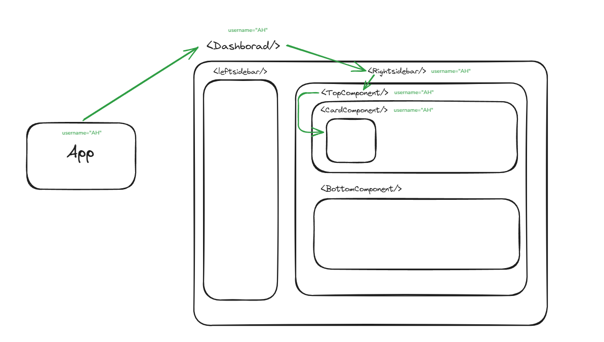

# React Notes

### Framework v/s Library

1. Framework has very strict rules about variable naming conventions, folder structure etc
2. Library does not have any such rules to be used.
3. React is a library

### React

1. React makes SPA (Single Page Applications). It means the page does not get reloaded.
2. New documentation of react is at react.dev
3. We have react as the library and we have react-dom and react-native as attachments
4. React dom is used when we work on websites. It is basically the react library implementation on web.
5. React native is used when we work on mobile apps.

### npm vs npx

1. `npm` stands for Node Package Manager. `npm` allows users to install node packages into the system.
2. `npx` stands for Node Package Executer. `npx` allows users to execute the packages directly without need of installing them first.

### Creating React app

1. `npx creat-react-app <app-name>`. create-react-app is a very bulky utility. It installs a lot of things that we might or might not use in our projects.
2. `npm create vite@latest` is used to create react app using vite bundler.

### How react renders html when run

1. create-react-app
   1. React app created using create-react-app has index.html file in public folder. This index.html file is loaded when the react app is run.
   2. React under the hood uses JS and you need to inject JS to the html file for its working using `<script>` tag.
   3. The script is not injected directly here but react-script dependency (found in package.json) goes to the index file and then injects the JS file (say index.js) into it behind the scene.
2. vite
   1. The react app created using vite has index.html file present in the root of the project.
   2. It directly injects the JS (say main.js) file to the index.html using `<script>` tag.
3. In both the cases, in the injected files (index.js or main.js), we have code like:-
   `ReactDOM.createRoot(document.getElementById("root")).render( <App /> );`
   here, React creates it own DOM (called Virtual DOM) and compared it with actual DOM to know which DOM elements need changes.
4. Each index.html file has a `<div id='root'>`.
5. Thus, react injects/renders the <App/> component into the div with id=root on the index.html page.
6. Since, there is only one index.html file in the whole react app, thats why react makes a SPA (Single Page Application)

### `<> </>`

1. Empty div or `<> </>` are known as fragments in react.

### React elements

1. React tries to form a tree from the html that we return in a function. It means all the components are converted to a tree by bundlers like babel, vite etc in React.
2. For eg. we returned `<a href="www.google.com">Google Link</a>` in a component (or function).
3. React will try to create a tree out of it,
   ```javascript
   {
   type:'a',
    props:{
            href: 'www.google.com',
            target: '\_blank'
        },
   children: 'Google Link'
   }
   ```
4. The above tree needs a custom renderer to understand it and convert the HTML written in it to such a form understandable by the browser.

### Adding variables in JSX

1. If you want to add a variable in returned JSX, you need to enclose it in `{<variable-name>}`.
2. E.g, `const name ="AH"; return (<h1> Hi! {name}</h1>)`
3. Note, you enclose evaluated expression in `{}`. It means you can't write JS code (say if else etc) in it but the evaluated value of the expression.
4. In React.createElement(type,props,children,...variables), the last parameter is varibles. All the injected variables are passed to this createElement function.

### Advantage of using React

1. React has a advantage of updating variables at all the places wherever the variable's value is being displayed in UI. React controlls the UI updations.
2. React hooks are a way to update things in UI effeciently.

### useState()

1. This hook is used to control the state of a variable. This function returns a variable with the initially assigned values and a function reference which can be used to update the state of the variable.
2. `const [<variable>, <setVariable>] = useState(<variable initial value>)`, e.g const [counter, setCounter] = useState(10)
3. Note:, the actual value of the variable is not manipulated by the set method. It only changes the state of the variable and update the new state value of the variable in UI wherever it is used.
4. <setVariable> receives a callback, you can get the last updated state of the <variable> in it.
   1. `setCounter((prevCounterValue) => prevCounterValue+10)`, here we are adding 10 to the previous state of the counter.

### createRoot()

1. It creates a DOM like structure. The browser has its own DOM and the createRoot() will have its own DOM.
2. It compares browser DOM with its DOM and only updates the things which are updated in UI.
3. In bowser, if anything changes, the whole DOM is deleted and a new DOM is painted again. This process is also called Page Reload.
4. In virtual DOM, the browser DOM is traced in tree like structure only update the things in browser DOM which are updated in virtual DOM.
5. Whenever some element is updated, the vitual DOM is updated immediately. This sometimes leads to unnecessary hitting the update animations of DOM.
6. Suppose there comes a request to update a UI element, the update is propogated to virtual DOM and in the meanwhile, a new update came for the same UI element, then again the virtual DOM is updated.
7. Thus, we needed a way to skip the intermediate/unnecessary virtual DOM updates.

### React fibre

1. This is the new algorithm used to update the Virtual DOM in React.
2. This save some unnecessary work done to update DOM for some continous updates of the elements.
3. Its key feature includes the ability to pause, abort and reuse work as new updates come in for elements. It also the ability to assign priority to different types of updates.
4. Important resource: https://github.com/acdlite/react-fiber-architecture
5. Features of Fibre:
   1. pause work and come back to it later.
   2. assign priority to different types of work.
   3. reuse previously completed work.
   4. abort work if it's no longer needed.

### Hydration

1. Whenever a webpage is rendered, the HTML and CSS is loaded like you will be able to see buttons etc but you will not be able to interact with them until the JS is loaded.
2. The injection of the JS into layoout is called Hydration.

### Reconciliation

1. The alogirthm react uses to diff one tree with another to determine which parts need to be changed.
2. Reconciliation is the algorithm behind what is popularly understood as the "Virtual DOM".
3. A high-level description goes something like this:
   1. When you render a React application, a tree of nodes that describes the app is generated and saved in memory. The structure can be similar to
      ```javascript
      {
      type:'a',
      props:{
                href: 'www.google.com',
                target: '\_blank'
            },
      children: 'Google Link'
      }
      ```
   2. This tree is then flushed to the rendering environment — for example, in the case of a browser application, it's translated to a set of DOM operations. The tree is flushed to rendering env when .render() is called.
   3. When the app is updated (usually via setState), a new tree is generated. The new tree is diffed with the previous tree to compute which operations are needed to update the rendered app. It means the only changed part in virtual DOM is moved to the Actual/Browser DOM.
4. Fibre is a rewrite of the old reconciler.
5. Key points of Fibre:
   1. Some component are assumed to generate substantially different trees. React will not attempt to diff them, but rather replace the old tree completely.
   2. Diffing of lists is performed using keys. Keys should be **stable, predictable, and unique**. It means if you use keys in your UI components like `<li>`, `<button>` etc, the new fibre diff algo work faster on them.
6. In a UI, it's not necessary for every update to be applied immediately; in fact, doing so can be wasteful, causing frames to drop and degrading the user experience.
7. Different types of updates have different priorities — an animation update needs to complete more quickly than, say, an update from a data store.

### Props

1. Props make the component reusable.
2. Basically props are passed to a component to alter values, styling etc in it and that makes a thing reusable.
3. Props can be sent in the following way:
   1. `<Component prop1=value1 prop2=value2/>`
4. You cannot pass the array or object using prop1=value1 etc, this will throw error. You have to enclose them in variables.
   1. `<Component prop1=[1,2,3] prop2={name:"AH"}/>`, This is wrong and will throw error.
   2. `<Component prop1={[1,2,3]} prop2={{name:"AH"}}>`, This is correct.
5. Try to give default value for props so if some props is not passed things dont break in UI.

### useCallback()

1.  It is a react hook that lets you cache a function definition between re-renders.
2.  It helps optimize performance by preventing unnecessary re-creations of functions on every render.
3.  When you pass a function as a prop or use it in a dependency list of another hook (like useEffect), React may recreate that function every time the component re-renders. This is inefficient for large applications.
4.  The useCallback hook helps avoid this by only recreating the function when certain dependencies change.
5.  Syntax:
    ```javascript
    const memoizedFunction = useCallback(() => {
      // function logic
    }, [dependencies]);
    ```
    Here, dependencies are an array of values that React will watch. If any of these values change, React will recreate the function. If none of these values change, the function will stay the same.
6.  Deepdive:

    1. In React, everytime a component re-renders, all the functions declared inside the component are recreated by default.
    2. The functions, which uses the variables declared in components to perform some computations and then the computed values are being used in UI, those functions needs to get updated so they get the new value of the variables which was previously computed by them.
    3. Suppose, we have the following code,

    ```javascript
    const counterComponent = () => {
      const [count, setCount] = useState(0);
      const [incrementalSteps, setIncermentalSteps] = useState(0);
      const [decrementalSteps, setDecrementalSteps] = useState(0);

      const incrementCounter = () => {
        setCount(count + incrementalSteps);
      };

      const decrementCounter = () => {
        setCount(count - decrementalSteps);
      };
    };
    ```

    > Here, whenever the counterComponent is rerendered, a new copy of incrementCounter() and decrementCounter() will even though they are dependent only on the incrementalSteps and decrementalSteps values respectively.

    4. Thus, if you use useCallback()

    ```javascript
    const counterComponent = () => {
      const [count, setCount] = useState(0);
      const [incrementalSteps, setIncermentalSteps] = useState(0);
      const [decrementalSteps, setDecrementalSteps] = useState(0);

      const incrementCounter = useCallback(() => {
        setCount(count + incrementalSteps);
      }, [incrementalSteps]);

      const decrementCounter = useCallback(() => {
        setCount(count - decrementalSteps);
      }, [decrementalSteps]);
    };
    ```

    > Here, the incrementCounter() and decrementCounter() will only be recreated when incrementalSteps and decrementalSteps value is changed respectively.
    > The incrementCounter() will not be recreated even if the value of decrementCounter is changed.

    > Here, incrementCounter() is dependent upon 2 values count and incrementalSteps. But only incrementalSteps value change is being used to update the incrementCounter.  
    > Thus, even if the value of count is changed the incrementCounter will not be recreated and get the updated value of count.
    > In the above code, we are using setCount() inside the incrementCounter() so we dont have to worry as setCount() will always have access to the latest value of count.  
    > But, if we have to use count value directly into the incrementCounter() to do some computations, then we need to add the count variable as dependency.  
    > Otherwise, the incrementCounter() will always work on the stale value of the count function until it is recreated.

### useEffect()

1. Syntax:
   ```javascript
   useEffect(() => {
     // Your side effect logic goes here
   }, [dependencies]);
   ```
2. We define a list of dependencies in it, the dependencies can be variables, functions etc.
3. Whenever, any of the dependencies changes its value or state, the callback function defined in the useEffect() is called.
4. We can use this feature to call other functions which depends on the dependencies listed in the useEffect().

### useRef()

1. The useRef() hook is a very useful hook in React that allows you to persist values between renders without causing a re-render when the value changes. It's commonly used for two purposes:
   1. Accessing DOM Elements: You can use useRef() to directly reference a DOM element (like an input field, button, or div) in your React component.
   2. Storing Mutable Values: You can store any value in a ref that you want to persist across renders without triggering a re-render when the value changes (like storing a previous value, timer ID, or a flag).
2. Syntax:
   `const myRef = useRef(initialValue);`
3. Suppose, you have a count value created using useState(). You want to update the count value but also wanted to preserve the current value before the update. Here, before calling the setCount(), you can use useRef() to preserve the curremt value.

### useId()

1. The useId hook in React is a way to generate unique IDs for elements in your components. It's useful when you need a unique identifier for elements, especially when you're dealing with accessibility (like for labeling form inputs) or other situations where each element needs a unique reference, such as for id attributes in HTML.
2. Previously, we need to provide the id manually, which leads to duplication of ids when the component is reused or if we use math.random() then it sometimes also leads to duplication of values.
3. The useId hook solves this problem by automatically generating stable, unique IDs that are consistent across renders, even if the component is re-rendered or re-mounted.
4. useId() generates a unique id for the component instance. The generated id is guaranteed to be same on every render and re-render of the component.
5. The ids are generated to bind html components like binding label with imput field.

### Custom Hooks

1. Hooks are just functions that are created to perform some task.
2. Custom hooks are created to club the use of multiple other hooks to add a level of abstraction to the code.
3. Custom hooks used in a code are underneath calling other react hooks and performing complex calculations on data.

### React Router

1. This used to control routing of the react app.
2. Loader:
   1. We can do the api calls directly where we have the routing config for the react app. This is used to optimize the things.
   2. The optimization happen as, when you hover over a link in header or anywhere which have the link to the other route, as hovering is also considered as an event, thus at hovering event, loader calls the api fetch for the data related to the link.
   3. It also helps in caching the called api results.

### Need for Context

1. Consider the following image:  
   
   1. Here, suppose `App` component has a prop `username="AH"`. `App` has a component `Dashboard`. `Dashboard` has some components organised in the shown manner.
   2. Suppose, `CardComponent` component uses the prop `username`.
   3. Now, we need to pass the `title` component in the manner show by green arrows in the above image from `App` to `CardComponent`
   4. Here, the components like `Dashboard`, `Rightsidebar`,`TopComponent` are receiving a prop (`title`) which they are not using for themselves but only passing it to other component.
2. A potential solution can be if we could build something global that which holds all the props needed in out components. All the components fetch any prop they need from the global thing.
3. Any component can push the props to the global thing and also fetch props from it.

### Context Api and Redux

1. Context Api and Redux solves the above problems.
2. Context Api is only associated with React.
3. Redux is third party library which helps in managing the state of data passed.
4. In react, we have the `react-redux` library to handle things.
5. `redux-toolkit` (RTK) is an easier version of the `redux` library present in market.

### Context Api

1. The following steps are followed to create the context:

   - Create a js file for the context to be defined. Each multiple contexts in a single project like login context, user context, product context etc.
   - Now, we use the `createContext` method defined by react to create the context.

     ```javascript
     const context = React.createContext();
     export default context;
     ```

   - Each context gives a **provider**. Since a context is used to provide variables when needed.
   - All the components, which need access to the variables defined inside the context, will be wrapped inside the context.
   - The context will act as a wrapper around the components.

     ```
     <context>
        <component1/>
        <component2/>
        <component3>
           <component4/>
        </component3>
     </context>
     ```

   - All the components inside the wrapper will get access to the varibles present inside the wrapper.
   - We need to define the provider for our context which will be a `jsx` component.

     ```javascript
     import context from "./context.js";
     function ContextProvider({ children }) {
       const [user1, setUser1] = userstate(null);
       const [user2, setUser2] = useState(null);
       return (
         <>
           <context.Provider value={{ user1, setUser1, user2, setUser2 }}>
             {children}
           </context.Provider>
         </>
       );
     }
     ```

   - The varibles defined will passed as props to the other children components from the provider.
   - The access of the store/context can be given in `main.jsx` or `app.jsx`.
   - You need to send both the variable and setVariable method in the context so the set method can be used to set data and the variable can be used to get the data

2. We can give default values to context also, when creating it using createContext().

   - The default values can be both variables and functions.
   - We dont have to give the function definition as default values. We can just declare the functions.

     ```javascript
     const UserContext = createContext({
       //The below are default variables the UserContext is going to have.
       username: "default user",
       profileStatus: "active",

       //The below are the functions that the UserContext will be having. We need to define the functions before they are used.
       changeUsername: () => {},
       setProfileStatusInactive: () => {},
       setProfileStatusActive: () => {},
     });
     ```

3. The context api is not built for very big projects. In big projects we need to use third party state management solutions like Redux, zustand etc.

### Redux

1. Redux is an independent state management library.
2. Redux has some its implementations in different frameworks. E.g react-redux
3. `react-redux` acts as a bridge for implementing redux in react.
4. Initially, `Flux` was designed by facebook to handle the state managemnet issues.
5. Flux
   1. It has 2 main things
      - State managment
      - Data flow.
        - The ease in updation of data was the main focus here. In context api, while updating arrays/objects, we need to spread them so the previos values does not get lost. But in `Flux`, the data flow was such that we dont have to bother about it.
6. Enhancements of Flux (intro to `Redux`):
   1. There should be single source of truth i.e there should be a single store only for the entire app.
   2. The state should be readonly. The state should not be modified or mutated.
   3. The changes in variables should be made only through functions (also known as `reducers`)

### Redux toolkit

1. `redux-toolkit` makes setting up the `redux` more convenient.
2. Basically, it makes it easy to configure the `redux`.
3. It contain some helpers and backend that makes things simple to use for `redux`

### Things in Redux and Redux toolkit

1. Store
   1. The store will be the single source of truth for the variables.
   2. It will store all the shared variables that the components will use.
   3. The store can be put in `src` folder of the project or inside any folder like `store` or `app` anything.
   4. The retrieval of values can be done from the store itself.
2. Reducers
   1. These are functions that are used to change anything inside the store.
   2. In redux-tookit, the reducers are known as **`slices`**.
   3. The reducers/slices are put under `features`.
   4. An app can have multiple features and so we can have multiple reducers/slices as well.
3. useSelector()
   1. This is used when we need to fetch a variable/ value from the store.
4. useDispatch()
   1. This is used to send a variable/value to the store

### Steps to create store

1. We need to use `configureStore` functionality of the redux-toolkit to create store.
2. Syntax

   ```javascript
   import { configureStore } from "@reduxjs/toolkit";
   import reducer1 from "file-path";
   export const store = configureStore({ reducer: reducer1 });
   ```

### Steps to create reducers/slices

1. We will be using `createSlice` method of the redux-toolkit to create the reducers.
   ```javascript
         const <sliceName> = createSlice({})
   ```
2. We need to define the initialState of the store. Note: the reducers/slices are used to manage the data flow of the store.
   1. We can assign any value to the initial state.
3. createSlice()

   1. It takes the following properties as parameters:-

      1. `name` (It is the name of the reducer/slice you want to give)
      2. `initialState`
      3. `reducers`

         - reducers is an object which contains properties and functions.
         - ```javascript
           reducers: {
             property1: (state, action) => {};
             property2: (state, action) => {};
           }
           ```
         - In context api, we were only declaring the functions but here in reducers we need to write definition for the functions as well.
         - Each function defined in reducers gets access to 2 values.
           1. `state` :- It gives access to the current state of the variables that we have defined in the initialState.
           2. `action` :- It contains the values that we pass to the function to perform some task of the data present in the state. For eg, if there are 10 todos in the current state and we need to delete a particular todo with the given id. We get the access of id from the `action`. action has a `payload` property which is an object in itself that contains the values that we send. eg:
              ```javascript
              const todoText = action.payload.todotext;
              ```
         - We can easily update the state of any variable by simple assigning new value to it.
           - `state.<variable> = <new-value>`

4. We need to export the reducers separately as the reducers are the only way to update the variables. Thus, those will be used individually.
   1. `export const { <property1>, <property2> } = <sliceName>.actions;`
5. We also need to export the reducer also so that we can register it with the store. The store will only allow the registered reducers to make changes to the data.
   1. `export default <sliceName>.reducer;`
6. Example

   ```javascript
   import { createSlice, nanoid } from "@reduxjs/toolkit";

   const initialState = {
     todos: [{ id: 1, text: "Hello World" }],
   };

   export const todoSlice = createSlice({
     name: "todo",
     initialState,
     reducers: {
       addTodo: (state, action) => {
         const todo = {
           id: nanoid(), //This used to generate a new id each time.
           text: action.payload.text,
         };
         state.todos.push(todo); //Here, we are updating the state of the variable todos
       },
       removeTodo: (state, action) => {
         state.todos = state.todos.filter(
           //Here we are also updating the value.
           (todo) => todo.id != action.payload.removeTodoId
         );
       },
     },
   });

   export const { addTodo, removeTodo } = todoSlice.actions; //Here we have exported the reducers individually so that they can be used to update the data.
   export default todoSlice.reducer; //We have to export the reducer separately so we can register them with the store.
   ```

### useDispatch() and useState()

1. These are functions of react.
2. These act as the bridge between the react and redux.
3. These wire up the things between react and redux.
4. useDispatch()
   1. useDispatch() uses a reducer to make changes in the store.
   2. Syntax:
      ```javascript
      const dispatch = useDispatch();
      dispatch(reducer1(params1, params2)); //The params will be retrieved inside the reducer1 from action.payload
      ```
5. useSelector()
   1. useSelector() can be used to access the needed values using the store.
   2. We get the `state` access inside the useSelector(). We can retrieve values from it using a callback.
   3. Syntax:
      ```javascript
      const todos = useSelector((state) => state.todos);
      ```

### Provider

1. In react-redux implementation, we also have to wrap things in `provider` like we were doing in context-api.
2. We can wrap things in both `main.jsx` or `app.jsx`. If we wrap them in main.jsx then the app as well as all the components defined inside app will get access to the store but if we wrap it in app.jsx then all the components except app gets access to the store. The access is necessary to call the useSelector and useDipatch methods.
3. Syntax:
   ```javascript
   import { Provider } from "react-redux";
   import { store } from "./app/store.js";
   createRoot(document.getElementById("root")).render(
     <Provider store={store}>
       <App />
     </Provider>
   );
   ```
